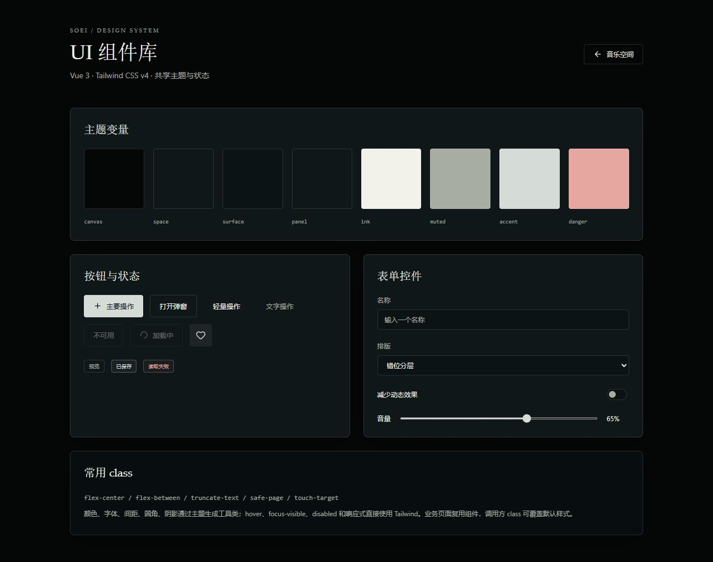

# 实施与验收记录

日期：2026-10-08；版本：0.1.0 开发版；需求依据：项目任务书_v1.0.md；设计依据：ui稿中的五张 PNG。

## 实现与待验收范围

| 模块 | 当前实现 | 尚未完成或验证 |
| --- | --- | --- |
| 音乐空间 | 参考画廊、中心主封面、hover/键盘信息、响应式、环境色、搜索、专辑/歌手/列表分类、收藏/最近播放 | 万首库性能、虚拟列表 |
| UI 基础 | Tailwind v4 主题、常用 class、九种控件、本地图标/Artwork、/ui 预览、class 冲突合并 | 后续按实际复用需要补充复杂组件 |
| 导入与索引 | 原生选文件/目录、可取消扫描、规范化路径去重、Lofty 标签与封面缓存、同名 LRC、逐文件错误 | MP3/FLAC/OGG/AAC/M4A 样本矩阵、大目录和异常路径 |
| 播放 | 单个 Rust 输出线程/Sink、暂停/音量/Seek/停止、四种模式、队列调整、实际历史上一首 | 快速切歌取消合并、设备断开恢复、整队列损坏跳过策略 |
| 歌词/场景 | LRC 多标签/offset/毫秒精度、二分定位、无歌词回退、三种布局、长句回退、全局字号/偏移、控制层和转场 | 实机长句/字号/同步误差、独立 TransitionEngine/预加载、逐曲模板界面 |
| 设置/存储 | 八种设置分类、SQLite 版本迁移、收藏/队列/播放列表/偏好保存 | 国际化、自启动、逐曲视觉设置、播放列表重命名/删除/曲目管理、数据库恢复和文件重定位 |
| 壁纸/系统 | WorkerW 子窗口附着、显示器选择、单会话广播、只读壁纸权限、点击穿透、托盘、主动注册全局组合键 | Windows 实际图标层级、双 DPI/拔插/竖屏、Explorer/休眠恢复和退出清理；每屏歌词与资源降级 |
| 音频响应 | 真实 PCM RMS 和三段 FFT、原子传递/限幅/平滑、省电与减少动态关闭光效 | 三频段独立效果、完整质量档位、视频/多屏性能 |
| 交付 | 源码/锁文件、开发说明、自动检查、自制测试样本 | 正式安装/卸载/签名、完整媒体矩阵、性能和两小时稳定性报告 |

完整 v1.0 尚未达到最终验收条件。未通过项继续属于原任务范围；构建成功与浏览器预览不能替代真实桌面、多屏和系统验收。

## 架构与边界

- Vue 按 library、player、lyrics、visual、settings 分功能组织，共享原语放在 components/ui。Pinia 持有播放投影和偏好，Router 提供音乐空间与组件预览。
- audio.rs 拥有唯一输出流。窗口消费带 sessionId、递增 revision、真实位置与能量的快照；隐藏主窗口或切换场景不销毁音频。
- library.rs 负责扫描/标签/封面，storage.rs 使用 SQLite WAL 和 user_version=1 迁移，拒绝较新数据库，保留原数据。
- wallpaper.rs 附着 Windows WorkerW，仅改变本应用窗口；失败后清理已建窗口并返回错误。该实现须按 A07/A08 实测。
- main 与 wallpaper-* 分开配置权限，自定义写命令也校验窗口来源。壁纸不能选文件/写设置/注册快捷键；资源协议仅允许缓存和选定背景，没有开放整个磁盘。
- 浏览器 HTML Audio 用于开发预览，不能作为 Tauri 单会话或壁纸验收证据。

## 已执行验证

环境：Node 22.22.2、pnpm 10.33.0、Rust stable 1.96.0、当前 Windows 会话。尚未冻结最低性能设备。

| 检查 | 实际结果 |
| --- | --- |
| pnpm check | 通过：Vue/TS 严格类型、ESLint、Prettier、Vitest 16 项（包含播放与歌词绑定回归） |
| pnpm build | 通过：Vite 生产构建，组件预览独立分块 |
| pnpm tauri build --no-bundle | 通过：Release 可执行文件 src-tauri/target/release/soei.exe；未生成正式安装包 |
| pnpm tauri build --debug --no-bundle | 一键测试版通过：src-tauri/target/debug/soei.exe，附带可离线播放的测试旋律与 LRC |
| Rust cargo check / fmt | 通过 |
| Rust 单元测试 | 6 项通过：内置测试素材导出/36 秒音频索引/同名 LRC、队列模式、WAV 解码/前后 Seek/能量、Unicode 路径索引/同名歌词/损坏文件、迁移/设置往返、拒绝新版数据库 |
| 原生设备测试 | native_output_seek_pause_resume 单独执行通过：零音量输出、位置推进、暂停保持、继续、前后 Seek、停止清理 |
| 浏览器 | 搜索 Purity、收藏、设置开关、进入/返回场景、隐藏控制层键盘访问、测试 WAV 导入/实际进度/暂停/键盘 Seek |
| 一键播放与歌词 | 浏览器实测：点击播放测试、实际时间推进与歌词切换、暂停、跳到 24.5 秒对应歌词、回到 1 秒首句；原生设备测试使用同一段 36 秒 WAV 并通过 |
| 组件预览 | 输入、选择、开关和按钮状态正常；模态焦点限制、Esc、关闭后焦点恢复通过 |
| 响应式 | 1440×960、600×720 和当前侧栏宽度下画廊及组件页面可用 |

组件页面截图：

测试素材为自行生成的 12 秒、8 kHz、单声道 PCM16 WAV（测试音楽.wav），配套中日英 LRC。损坏.mp3 为故意无效的文件，没有第三方歌曲。

一键试听素材为 `public/demo/soei-test.wav`：36 秒、22.05 kHz、单声道 PCM16 自制器乐旋律，配套 9 句同步测试歌词（无演唱）及原创 SVG 封面。浏览器同名 LRC 自动关联及单曲歌词绑定均限当前会话；桌面版将测试音频/LRC 保存到应用数据目录并使用原生播放服务。

## 验收对应与下一阶段

- A01/A02：WAV 索引、播放和 Seek 有测试证据，其余编码与异常/大库矩阵待验证。
- A03/A04：浏览、歌词有实现和基础测试；播放列表完整管理、长句和实机同步误差待验收。
- A05/A06：场景控制可运行，快速切歌压力和 Windows 窗口模式 20 次往返待验收。
- A07/A08/A09：原生壁纸/托盘/组合键已接入，真实桌面、多屏和系统恢复尚无通过证据。
- A10：迁移与偏好测试通过，恢复/缓存/重定位/完整重启矩阵未通过。
- A11/A12：性能、完整编码、安装、三种语言和发布许可审核未通过。

下一步先在原生窗口执行导入到播放、重启保存及格式矩阵，再核对图标后方壁纸层级与多屏恢复；完成剩余 P0/P1 后，在固定 Release 设备上采集性能、稳定性和安装记录。
